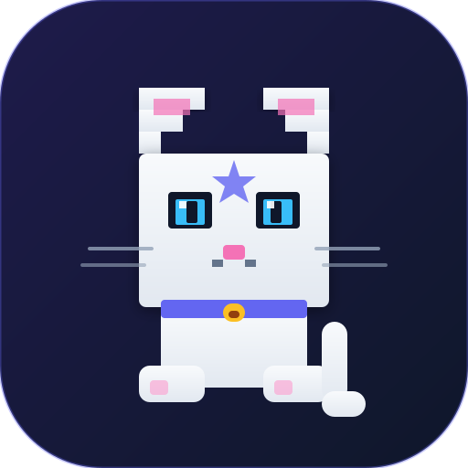

<p align="center">
  
</p>

<p align="center">
  <strong>A tiny desktop companion that keeps you company.</strong>
</p>

<p align="center">
  A playful pet that lives on your desktop, keeps you company, and can grow with bundled abilities and developer integrations.
</p>

<p align="center">
  
</p>

<div align="center">
  <p><sub>by <b>Boring Dystopia Development</b></sub></p>
  <p>
    <a href="https://boringdystopia.ai/"></a>&nbsp;
    <a href="https://x.com/alvinunreal"></a>&nbsp;
    <a href="https://t.me/boringdystopiadevelopment"></a>&nbsp;
  </p>
</div>


---

## 2-minute Quick Start

Download and launch the desktop app from [NekoDrift Releases](https://github.com/alvinunreal/nekodrift/releases/latest). A companion pet appears immediately; bundled abilities make it feel alive without requiring an agent setup.

If you also want coding-agent integration, install the NekoDrift Agent Skill with [skills.sh](https://skills.sh/):

```bash
npx skills add alvinunreal/nekodrift --skill nekodrift
```

Then open Claude Code, Cursor, Codex, or another skill-aware agent and say:

```text
Use the NekoDrift skill. Install NekoDrift for me, connect this agent, and verify the integration works.
```

For project setup, open your agent inside the repo and say:

```text
Use the NekoDrift skill. Help me choose or install a pet, configure it for this project, and verify the project integration.
```

Useful prompts:

```text
Use the NekoDrift skill. Configure this project for Claude Code with a pet.
Use the NekoDrift skill. Debug why nekodrift_status is unavailable.
```

## Star NekoDrift

Here is an extra GIF of me starring my own repo to encourage you to do the same. If NekoDrift makes your coding setup a little more fun, please give the repo a star.

<p align="center">
  
</p>

## What is NekoDrift?

NekoDrift is a tray-first desktop companion app. A pet appears on your desktop, keeps you company, and can use bundled abilities for ambient presence, breaks, playful actions, and focus sessions. Coding-agent integrations are still supported as an advanced developer layer.

- **Desktop companion** - a small pet that idles, reacts, and gives NekoDrift a friendly presence even before developer tools are configured.
- **Bundled abilities** - first-party plugins can add ambient check-ins, break nudges, playful pet actions, focus timers, safe little walks, and optional developer notifications.
- **Developer integrations** - advanced setup for Claude Code, Cursor, Pi, and MCP-capable tools when you want coding activity to drive the pet.
- **MCP ready** - any MCP-capable agent can send short safe speech bubbles and reactions through the NekoDrift MCP server.
- **Pet-pack friendly** - loads installed animated pet packs and can route a selected agent/project to its own pet window.
- **Privacy-conscious by design** - automatic hook speech is static and local; prompts, code, logs, command output, URLs, paths, and secrets are not shown in bubbles.

## Manage your pets

Browse installed pets, preview their animations, and choose which companion should follow each coding agent from the NekoDrift desktop app.

<p align="center">
  
</p>

## Quick start

Install the desktop app, then optionally connect your coding agent.

### 1. Install NekoDrift Desktop

Download the latest app from [NekoDrift Releases](https://github.com/alvinunreal/nekodrift/releases/latest):

- **macOS Apple Silicon**: `NekoDrift-*-mac-arm64.dmg`
- **macOS Intel**: `NekoDrift-*-mac-x64.dmg`
- **Windows**: `NekoDrift-*-win-x64-setup.exe`
- **Linux**: `NekoDrift-*-linux-x86_64.AppImage`

Launch NekoDrift. You should see the desktop pet and the NekoDrift tray/menu-bar icon.

> Current builds may be unsigned. macOS or Windows may show a security warning the first time you open the app.

If macOS says the app is damaged or should be moved to Trash, remove the quarantine flag and open it again:

```bash
xattr -dr com.apple.quarantine /Applications/NekoDrift.app
open /Applications/NekoDrift.app
```

### 2. Optional: connect your agent

Use the desktop **Integrations** screen for global setup when available:

- **Claude Code** - installs NekoDrift MCP, Claude memory instructions, and optional Claude hooks.
- **Agent** - installs NekoDrift MCP, a managed instruction file, and the `@neko-drift/agent` plugin.

<p align="center">
  
</p>

For project-local setup, run the CLI from the project you want to configure:

```bash
npx -y @neko-drift/cli@latest configure --agent claude --pet <petId>
npx -y @neko-drift/cli@latest configure --agent agent --pet <petId>
```

If you prefer a permanent `nekodrift` shell command, install the CLI once with `npm install -g @neko-drift/cli` and replace `npx -y @neko-drift/cli@latest` with `nekodrift`.

Project-local setup can create project files such as `.claude/settings.local.json` or agent config files. Review them before committing because they may include the selected pet id.

## Advanced: agent integrations

NekoDrift integrations have three layers:

1. **MCP tools** for explicit agent actions.
2. **Agent instructions** so agents know when to use those tools.
3. **Hooks/plugins** for automatic decorative reactions during normal agent work.

### Claude Code

Claude Code integration supports:

- `nekodrift` MCP setup via Claude Code.
- Managed Claude memory instructions in `~/.claude/CLAUDE.md` and `~/.claude/nekodrift.md`.
- Managed Claude hooks in `~/.claude/settings.json`.
- Project-local setup through `npx -y @neko-drift/cli@latest configure --agent claude --pet <petId>` or the optional global `nekodrift` CLI.

Typical global MCP command shape:

```bash
claude mcp add --scope user nekodrift -- npx -y @neko-drift/mcp@latest
```

With a selected pet:

```bash
claude mcp add --scope user nekodrift -- npx -y @neko-drift/mcp@latest --pet <petId>
```

See [`docs/claude-integration.md`](docs/claude-integration.md) for the full file layout, hook mapping, project-local behavior, and safety rules.

### Generic agent

Generic agent integration supports:

- An MCP entry using `@neko-drift/cli mcp`.
- A managed `nekodrift.md` instruction file.
- The `@neko-drift/agent` plugin for automatic reactions.
- Global desktop setup and project-local config.

Project-local setup:

```bash
npx -y @neko-drift/cli@latest configure --agent agent --pet <petId>
```

### Generic MCP clients

Any MCP-capable editor or coding agent can talk to NekoDrift through the MCP server while the desktop app is running.

```json
{
  "mcpServers": {
    "nekodrift": {
      "type": "stdio",
      "command": "npx",
      "args": ["-y", "@neko-drift/mcp@latest"]
    }
  }
}
```

To target a specific installed non-default pet:

```json
{
  "mcpServers": {
    "nekodrift": {
      "type": "stdio",
      "command": "npx",
      "args": ["-y", "@neko-drift/mcp@latest", "--pet", "<petId>"]
    }
  }
}
```

Available MCP tools:

- `nekodrift_status` - check whether NekoDrift is reachable and which pet is targeted.
- `nekodrift_react` - set a short reaction on the target pet.
- `nekodrift_say` - show a short safe speech bubble, optionally with a reaction.

`nekodrift_say` messages must be short, single-line, and must not look like code, logs, secrets, URLs, or file paths.

## How it works

```text
Claude Code / Cursor / Pi / MCP client
  -> @neko-drift/mcp, @neko-drift/cli mcp, @neko-drift/claude hook, @neko-drift/agent plugin, or @neko-drift/pi extension
  -> @neko-drift/client
  -> NekoDrift desktop local IPC discovery file
  -> NekoDrift desktop IPC socket/pipe
  -> default pet or selected agent pet window
```

The desktop app writes a local discovery file containing an IPC endpoint and a per-run token. Clients must send that token with every request.

For Windows desktop + WSL agent setups, see [`docs/wsl-ipc.md`](docs/wsl-ipc.md) for the opt-in TCP transport.

When an integration is configured with `--pet <petId>`, NekoDrift asks the desktop app for a short-lived lease. Valid installed non-default pets open as explicit agent pet windows. Missing, invalid, broken, built-in, or default pet requests fall back to the desktop default pet.

## Reactions and speech

Automatic hooks are decorative and best-effort. They do not approve, deny, block, or change agent behavior.

Common reaction mapping:

| Agent activity | Reaction |
| --- | --- |
| Prompt/chat starts | `thinking` |
| File edit/write/patch | `editing` |
| Test-like shell command | `testing` |
| Permission request | `waiting` |
| Successful idle/stop | `success` |
| Session/error stop | `error` |

Generic shell activity is intentionally quiet by default. Hook/plugin speech is throttled and selected from local static message pools such as `Approval needed` or `Something failed`.

### Pi extension package

NekoDrift includes an experimental Pi extension package at `@neko-drift/pi`. Pi support is extension-first rather than MCP-first: the extension listens to Pi lifecycle/tool events and sends local best-effort reactions through `@neko-drift/client`.

```bash
pi install npm:@neko-drift/pi
pi install -l npm:@neko-drift/pi
```

Inside Pi, the extension registers `/nekodrift status`, `/nekodrift test`, `/nekodrift react <reaction>`, and `/nekodrift say <message>`. Automatic events do not forward prompts, assistant text, tool output, file contents, paths, URLs, or secrets. Real Pi CLI install validation is still required before marking the integration fully supported.

## Development

### Requirements

- Node.js 20+
- pnpm 11+
- TypeScript

No Bun runtime is required for development.

### Install

```bash
pnpm install
```

### Run the desktop app

```bash
pnpm dev:desktop
```

Equivalent package command:

```bash
pnpm --filter @neko-drift/desktop dev
```

### Checks

```bash
pnpm check
pnpm typecheck
pnpm build
pnpm test
```

NekoDrift currently uses lightweight Node contract checks instead of a full test framework. See [`docs/testing.md`](docs/testing.md).

### Package desktop builds

```bash
pnpm package:desktop:dir
pnpm package:desktop
```

Release process details live in [`docs/release.md`](docs/release.md).

## Workspace layout

```text
apps/desktop              Electron desktop app
packages/client           @neko-drift/client, local IPC client
packages/mcp              @neko-drift/mcp, MCP stdio server
packages/claude           @neko-drift/claude, Claude command and hook helpers
packages/agent            @neko-drift/agent, agent config and plugin integration
packages/pi               @neko-drift/pi, Pi extension package
packages/agent-events     Shared safe agent event speech helpers
packages/cli              @neko-drift/cli, user-run CLI and MCP/hook entrypoints
packages/pet-format       @neko-drift/pet-format, pet/catalog format types
docs/                     Documentation
```

## Documentation

- [`docs/claude-integration.md`](docs/claude-integration.md) - Claude Code setup, MCP, memory, hooks, and safety.
- [`docs/agent.md`](docs/agent.md) - Agent global/project setup, plugin behavior, and safety.
- [`docs/wsl-ipc.md`](docs/wsl-ipc.md) - Windows desktop + WSL MCP transport setup.
- [`docs/testing.md`](docs/testing.md) - test/check strategy.
- [`docs/release.md`](docs/release.md) - desktop release process.
- [`docs/workflow.md`](docs/workflow.md) - project workflow notes.

## Safety and privacy notes

- NekoDrift local IPC is local-only and protected by a per-run token.
- Hook/plugin errors are swallowed unless debug logging is enabled.
- Automatic speech is static and local; it does not include model-generated prompt text.
- Tool inputs and command text are used only for coarse reaction classification.
- Managed setup preserves unrelated user config and removes only NekoDrift-managed entries.
- Speech validation rejects code-like, secret-like, URL-like, path-like, or multiline messages.
